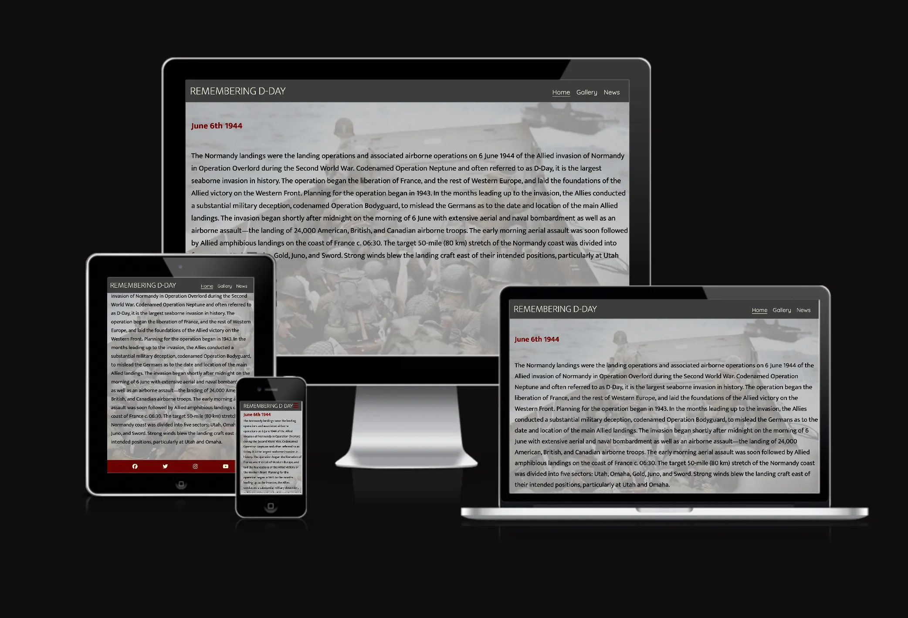
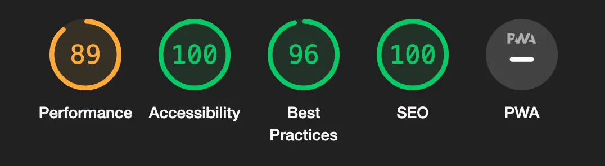

# Remembering D-Day

Remembering D-Day is a site that aims to provide users with information about the historical event of D-Day in world war 2, and encourage them to sign up for a newsletter where they can find more information and continue to learn about the event.
The site also provides users with a gallery of images taken from the event.
The site is targeted towards people who have an interest in historical events, and who are interested in learning more about what happened on D-Day.
It will be useful to users by providing them with some introductory information about the event as well as the images, and also an opportunity to subscribe to a newsletter to continue learning more details.

## Features 

### Existing Features

- __Navigation Bar__

  - Featured on all three pages, the full responsive navigation bar includes links to the Logo, Home page, Gallery and Newsletter page and is identical in each page to allow for easy navigation.
  - This section will allow the user to easily navigate from page to page across all devices without having to revert back to the previous page via the ‘back’ button. 

- __The landing page background image__

  - The landing includes a background image of soldiers in a boat preparing for battle to grab users attention and draw them to the topic of the site straight away.
  The image is covered with a greyish tint so that the colours don't distract from the text overlay.
  - This section introduces the user to Remembering D-Day with a memorable image.

- __Landing page text__

  - The text on the landing page begins with the date of the event, June 6th 1944.
  The date is coloured to match the theme colours of the site, to grab users attention and to stand out from the text.
  - The section of text underneath the date gives users some basic information about the event, to encourage them to learn more and subscribe to the newsletter on the news page of the site.
  - There are no flashy images or features on the landing page due to the described event being a serious subject, the feel of the landing page is therefore more sombre, as well as the colour palette.

- __The Footer__ 

  - The footer section includes links to the relevant social media sites for Remembering D-Day. The links will open to a new tab to allow easy navigation for the user. 
  - The footer is valuable to the user as it encourages them to keep connected via social media

- __Gallery__

  - The gallery provides the user with images taken from the actual event itself.
  The images are a selection of different aspects of the event, taken at differrent times throughout the day, from travelling in the boats, to landing on the beaches, to moving onwards through the terrain, as well as an image of soldiers helping others that had been wounded.
  - The final image in the gallery is an image of D-Day veterans today, this image in colourized, to contrast with the images taken from the actual event which are all black and white. 
  - This gives the user a feel for every aspect of what happened. 
  - This section is valuable to the user as they can see real moments captured from this historic event. 

- __The Sign Up / Newsletter Page__

  - This page will allow the user to subscribe to a Remembering D-Day newsletter, to learn more information about the event. The user will be asked to submit their full name and email address.

- __The Sign Up / Newsletter Page background image__

- The background image for this page is an image of one of the beaches where the event happened, taken from the modern day.
The image colours stand out much more than the background image on the landing page or the images in the gallery.
This gives users a feeling of positivity towards subscribing to the newsletter.

### Features Left to Implement

- One feature that would be implemented in future would be a link to the signup/newsletter page.
The link would be placed on the landing page, beneath the text to encourage users who want to learn more.
- Another feature for the future is an audio/video gallery page, where users can listen to audio and watch video clips taken from the event itself.

## Testing

- I tested that this page works in different browsers, Chrome and Safari.

- I confirmed that this project is responsive, looks good and functions on all standard screen sizes using the devtools device toolbar.

- I confirmed that the navigation, header, signup/newsletter page and form input fields are all readable and easy to understand.

- I have confirmed that the form works: requires entries in every field, will only accept an email address in the email field, and the submit button works.

### Validator Testing 

- HTML
  - No errors were returned when passing through the official [W3C validator](https://validator.w3.org/nu/?doc=https%3A%2F%2Fcode-institute-org.github.io%2Flove-running-2.0%2Findex.html)
- CSS
  - No errors were found when passing through the official [(Jigsaw) validator](https://jigsaw.w3.org/css-validator/validator?uri=https%3A%2F%2Fvalidator.w3.org%2Fnu%2F%3Fdoc%3Dhttps%253A%252F%252Fcode-institute-org.github.io%252Flove-running-2.0%252Findex.html&profile=css3svg&usermedium=all&warning=1&vextwarning=&lang=en#css)
- Accessibility
  - I confirmed that the colours and fonts chosen are easy to read and accessible by running it through lighthouse in devtools.

### Unfixed Bugs

The only unfixed bug is I was unable to perfect the responsiveness of the form elements and the gallery images for a landscape view on mobile device screens.

## Deployment

- The site was deployed to GitHub pages. The steps to deploy are as follows: 
  - In the GitHub repository, navigate to the Settings tab 
  - From the source section drop-down menu, select the Main Branch
  - Once the main branch has been selected, the page will be automatically refresh with a detailed ribbon display to indicate the successful deployment. 

The live link can be found here - https://jaysinna.github.io/Dday-info/

## Credits 

### Content 

- The code to make the navbar and the footer with social media links was taken from the Code Institute 'Love Running' project.

- The icons in the footer were taken from Font Awesome.

### Media

- The text information on the landing page was taken from Wikipedia, the link can be found here - https://en.wikipedia.org/wiki/Normandy_landings

- The images were taken from google images.