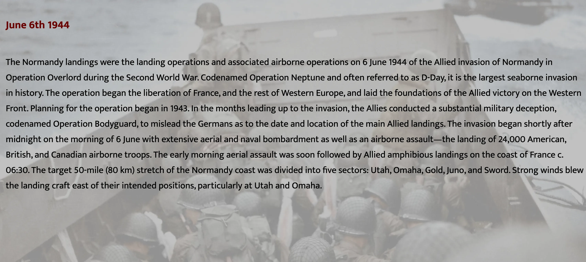
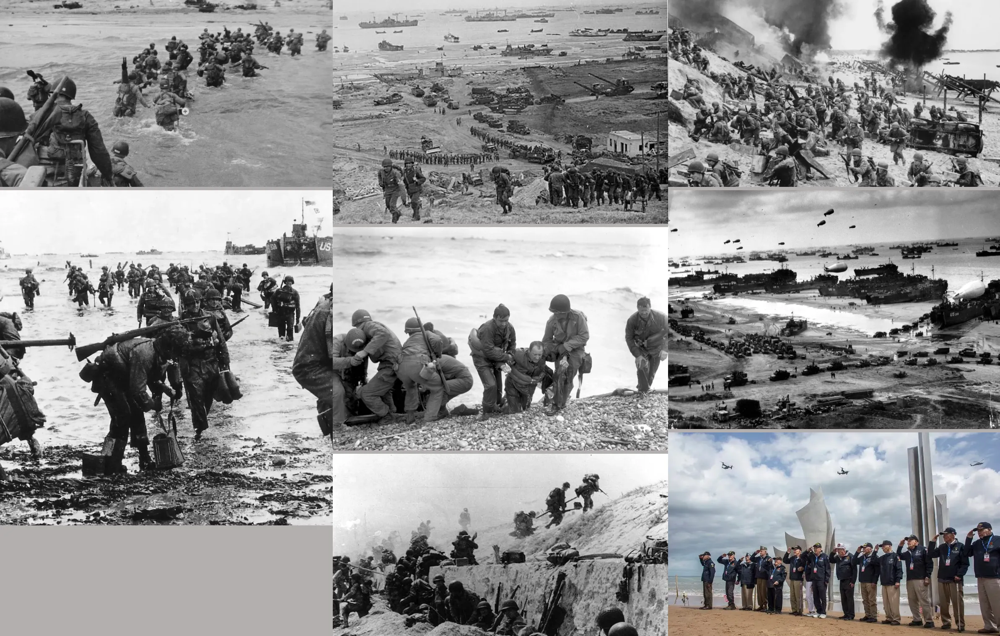
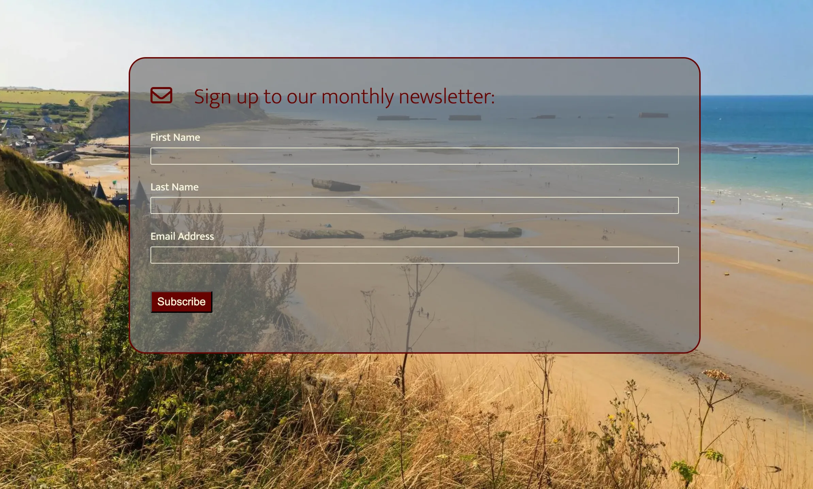

# Remembering D-Day

Remembering D-Day is a site that aims to provide users with information about the historical event of D-Day in world war 2, and encourage them to sign up for a newsletter where they can find more information and continue to learn about the event.
The site also provides users with a gallery of images taken from the event.
The site is targeted towards people who have an interest in historical events, and who are interested in learning more about what happened on D-Day.
It will be useful to users by providing them with some introductory information about the event as well as the images, and also an opportunity to subscribe to a newsletter to continue learning more details.

## Features 

### Existing Features

- __Navigation Bar__

  - Featured on all three pages, the full responsive navigation bar includes links to the Logo, Home page, Gallery and Newsletter page and is identical in each page to allow for easy navigation.
  - This section will allow the user to easily navigate from page to page across all devices without having to revert back to the previous page via the ‘back’ button. 

- __The landing background page image__

  - The landing includes a background image of soldiers in a boat preparing for battle to grab users attention and draw them to the topic of the site straight away.
  The image is covered with a greyish tint so that the colours don't distract from the text overlay.
  - This section introduces the user to Remembering D-Day with a memorable image.

- __Landing page text__

  - The text on the landing page begins with the date of the event, June 6th 1944.
  The date is coloured to match the theme colours of the site, to grab users attention and to stand out from the text.
  - The section of text underneath the date gives users some basic information about the event, to encourage them to learn more and subscribe to the newsletter on the news page of the site.
  - There are no flashy images or features on the landing page due to the described event being a serious subject, the feel of the landing page is therefore more sombre, as well as the colour palette.

- __The Footer__ 

  - The footer section includes links to the relevant social media sites for Remembering D-Day. The links will open to a new tab to allow easy navigation for the user. 
  - The footer is valuable to the user as it encourages them to keep connected via social media

- __Gallery__

  - The gallery provides the user with images taken from the actual event itself.
  The images are a selection of different aspects of the event, taken at differrent times throughout the day, from travelling in the boats, to landing on the beaches, to moving onwards through the terrain, as well as an image of soldiers helping others that had been wounded.
  - The final image in the gallery is an image of D-Day veterans today, this image in colourized, to contrast with the images taken from the actual event which are all black and white. 
  - This gives the user a feel for every aspect of what happened. 
  - This section is valuable to the user as they can see real moments captured from this historic event. 

- __The Sign Up / Newsletter Page__

  - This page will allow the user to gsubscribe to a Remembering D-Day newsletter, to learn more information about the event. The user will be asked to submit their full name and email address. 

For some/all of your features, you may choose to reference the specific project files that implement them.

In addition, you may also use this section to discuss plans for additional features to be implemented in the future:

### Features Left to Implement

- Another feature idea

## Testing 

In this section, you need to convince the assessor that you have conducted enough testing to legitimately believe that the site works well. Essentially, in this part you will want to go over all of your project’s features and ensure that they all work as intended, with the project providing an easy and straightforward way for the users to achieve their goals.

In addition, you should mention in this section how your project looks and works on different browsers and screen sizes.

You should also mention in this section any interesting bugs or problems you discovered during your testing, even if you haven't addressed them yet.

If this section grows too long, you may want to split it off into a separate file and link to it from here.

### Validator Testing 

- HTML
  - No errors were returned when passing through the official [W3C validator](https://validator.w3.org/nu/?doc=https%3A%2F%2Fcode-institute-org.github.io%2Flove-running-2.0%2Findex.html)
- CSS
  - No errors were found when passing through the official [(Jigsaw) validator](https://jigsaw.w3.org/css-validator/validator?uri=https%3A%2F%2Fvalidator.w3.org%2Fnu%2F%3Fdoc%3Dhttps%253A%252F%252Fcode-institute-org.github.io%252Flove-running-2.0%252Findex.html&profile=css3svg&usermedium=all&warning=1&vextwarning=&lang=en#css)

### Unfixed Bugs

You will need to mention unfixed bugs and why they were not fixed. This section should include shortcomings of the frameworks or technologies used. Although time can be a big variable to consider, paucity of time and difficulty understanding implementation is not a valid reason to leave bugs unfixed. 

## Deployment

This section should describe the process you went through to deploy the project to a hosting platform (e.g. GitHub) 

- The site was deployed to GitHub pages. The steps to deploy are as follows: 
  - In the GitHub repository, navigate to the Settings tab 
  - From the source section drop-down menu, select the Master Branch
  - Once the master branch has been selected, the page will be automatically refreshed with a detailed ribbon display to indicate the successful deployment. 

The live link can be found here - https://code-institute-org.github.io/love-running-2.0/index.html 

## Credits 

In this section you need to reference where you got your content, media and extra help from. It is common practice to use code from other repositories and tutorials, however, it is important to be very specific about these sources to avoid plagiarism. 

You can break the credits section up into Content and Media, depending on what you have included in your project. 

### Content 

- The text for the Home page was taken from Wikipedia Article A
- Instructions on how to implement form validation on the Sign Up page was taken from [Specific YouTube Tutorial](https://www.youtube.com/)
- The icons in the footer were taken from [Font Awesome](https://fontawesome.com/)

### Media

- The photos used on the home and sign up page are from This Open Source site
- The images used for the gallery page were taken from this other open source site

Congratulations on completing your Readme, you have made another big stride in the direction of being a developer! 

## Other General Project Advice

Below you will find a couple of extra tips that may be helpful when completing your project. Remember that each of these projects will become part of your final portfolio so it’s important to allow enough time to showcase your best work! 

- One of the most basic elements of keeping a healthy commit history is with the commit message. When getting started with your project, read through [this article](https://chris.beams.io/posts/git-commit/) by Chris Beams on How to Write  a Git Commit Message 
  - Make sure to keep the messages in the imperative mood 

- When naming the files in your project directory, make sure to consider meaningful naming of files, point to specific names and sections of content.
  - For example, instead of naming an image used ‘image1.png’ consider naming it ‘landing_page_img.png’. This will ensure that there are clear file paths kept. 

- Do some extra research on good and bad coding practices, there are a handful of useful articles to read, consider reviewing the following list when getting started:
  - [Writing Your Best Code](https://learn.shayhowe.com/html-css/writing-your-best-code/)
  - [HTML & CSS Coding Best Practices](https://medium.com/@inceptiondj.info/html-css-coding-best-practice-fadb9870a00f)
  - [Google HTML/CSS Style Guide](https://google.github.io/styleguide/htmlcssguide.html#General)

Getting started with your Portfolio Projects can be daunting, planning your project can make it a lot easier to tackle, take small steps to reach the final outcome and enjoy the process! 
